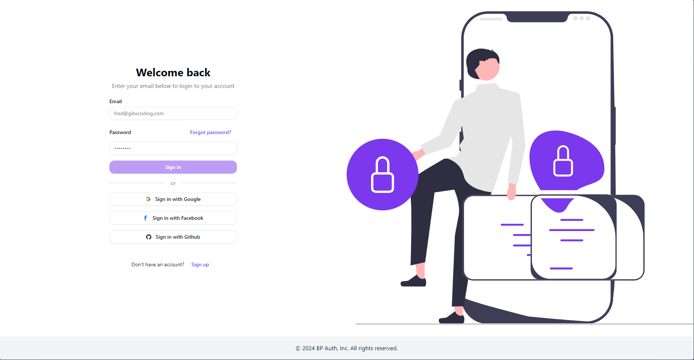
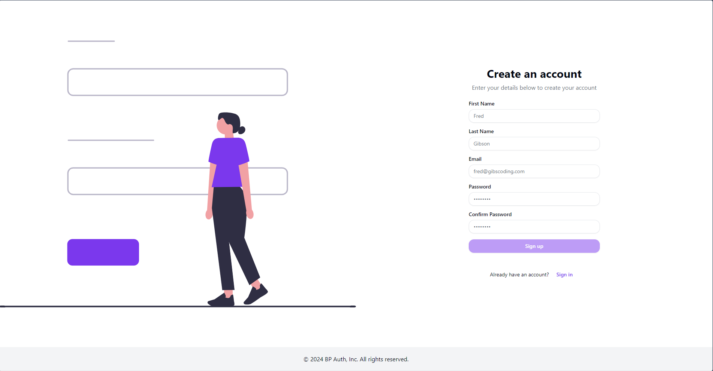

# Next.js & Django Authentication Boilerplate

This project is a comprehensive boilerplate for user authentication, integrating Next.js for the frontend and Django (with Django REST Framework) for the backend. It leverages modern tools and libraries for a smooth authentication flow, including JWT tokens, Amazon SES for email verification, as well as social login with Google, GitHub, and Facebook.

## Table of contents

- [Next.js \& Django Authentication Boilerplate](#nextjs--django-authentication-boilerplate)
  - [Table of contents](#table-of-contents)
  - [Overview](#overview)
    - [Screenshot](#screenshot)
  - [My process](#my-process)
    - [Built with](#built-with)
    - [Prerequisites](#prerequisites)
    - [Installation](#installation)
    - [Continued development](#continued-development)
  - [Author](#author)


## Overview

### Screenshot




## My process

### Built with

`BACKEND (Django)`

- [Django REST Framework(DRF)](https://www.django-rest-framework.org)
- [Djoser](https://djoser.readthedocs.io) - to handle user registration, login and password reset flows easily
- JWT Authentication - Token-based authentication stored in secure HTTP-only cookies
- Amazon SES - service for sending email verifications
- Social Authentication - third party login support with `Google`, `Github` and `Facebook`
- CORS - configured to allow secure interaction between frontend and backend

`FRONTEND(Next.js)`

- [Next.js](https://nextjs.org/docs) - highly dinamic frontend framework
- [ReduxToolkit](https://redux-toolkit.js.org/) - Redux toolset
- [TailwindCSS](https://tailwindcss.com) - For styles
- [shadcn/ui](https://ui.shadcn.com/) - Designed
- React Toastify - user friendly notifications


To get a local copy up and running, follow these simple steps.

### Prerequisites

- [Node.js](https://nodejs.org/) (Make sure you have Node.js installed)
- Python and Django (for running the backend)
-

### Installation

1. **Clone the repository**

   ```bash
   git clone https://github.com/adriancretu03/bp-auth.git
    ```

2. **Navigate to the project directory**

   ```bash
   cd bp-auth
    ```


`BACKEND`


3. **Navigate to the backend directory**

    ```bash
   cd backend
    ```

4. **Install dependencies**

   ```bash
   pip install -r requirements.txt
    ```

5. **Set up environment variables for the project**


6. **Run migrations to set up the database**

   ```bash
   python manage.py migrate
    ```

7. **Start the Django development server**

   ```bash
   python manage.py runserver
    ```


`Frontend`

8. **Navigate to the frontend directory**

    ```bash
   cd frontend
    ```

9. ** Install dependencies**

    ```bash
    npm install
    ```

10. ** Start the Next.js development server**

    ```bash
    npm run dev
    ```


### What I learned

1.  Form Handling with `react-hook-form` and shadcn/ui components:
    - I learned how to efficiently manage and validate forms using `react-hook-form`. One of the key things I implemented was dynamic form structure that handles multiple input fields based on a configuration array.

```js
<Form {...form}>
  <form onSubmit={form.handleSubmit(onSubmit)} className="grid gap-4">
    {config.map((input) => (
      <FormField
        key={input.labelId}
        control={form.control}
        name={input.labelId}
        render={({ field }) => (
          <FormItem>
            <div className="flex justify-between items-center">
              <FormLabel htmlFor={input.labelId}>
                {input.labelText}
              </FormLabel>
              {input.link && (
                <Link
                  href="/password-reset"
                  className={buttonVariants({
                    variant: "link",
                  })}
                >
                  {input.link.linkText}
                </Link>
              )}
            </div>

            <FormControl>
              <Input
                {...field}
                placeholder={input.placeholder}
                type={input.type}
                id={input.labelId}
                name={input.labelId}
              />
            </FormControl>
            <FormMessage />
          </FormItem>
        )}
      />
    ))}
  </form>
</Form>
```

2. Token Refresh Mechanism with `redux-toolkit`:
   - I implemented a token refresh mechanism to handle automatic reauthentication when a user's access token expires (HTTP 401 status).

```js
const baseQueryWithReauth = async (
  args: string | FetchArgs,
  api: BaseQueryApi,
  extraOptions: {}
) => {
  let result = await baseQuery(args, api, extraOptions);

  if (result?.error?.status === 401) {
    console.log("sending refresh token");
    // send refresh token to get new access token
    const refreshResult = await baseQuery(
      { url: "jwt/refresh/", method: "POST" },
      api,
      extraOptions
    );
    console.log(refreshResult);

    if (refreshResult?.data) {
      // store the new token
      api.dispatch(setAuth());
      // retry the original query with new access token
      result = await baseQuery(args, api, extraOptions);
    } else {
      api.dispatch(logout());
    }
  }
  return result;
};
```

### Continued development

As part of the ongoing development of this project, I plan to enhance the backend by replacing Djoser with custom-built authentication routes. This will provide greater flexibility, control over the authentication logic, and a deeper understanding of how JWT-based authentication works within Django REST Framework (DRF).

## Author

- Linkedin - [Adrian Cretu](https://www.linkedin.com/in/adriancretu03/)